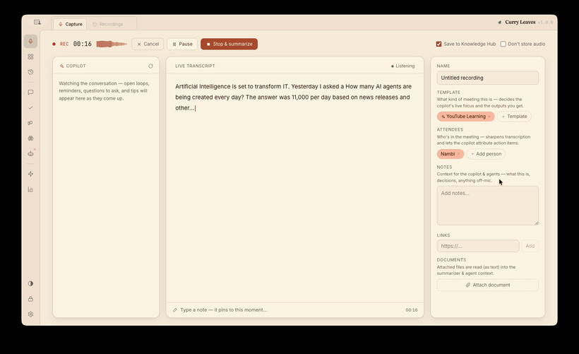
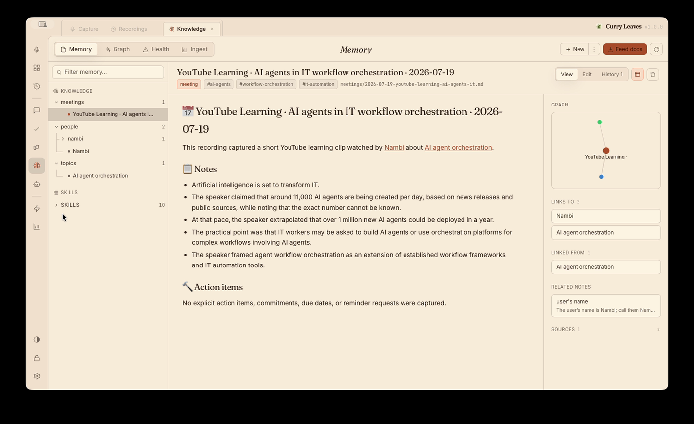
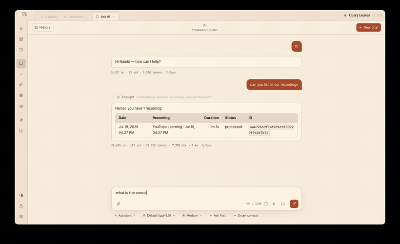
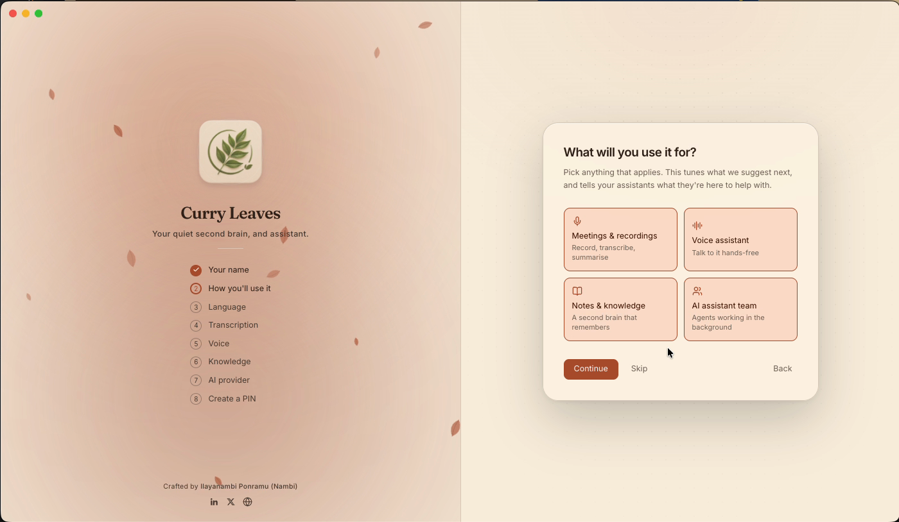

<p align="center">
  
</p>

<h1 align="center">Curry Leaves AI Assistant</h1>

<p align="center">Your private second brain — it listens, remembers, and gets things done. All on your own machine.</p>

<p align="center">
  <a href="https://pypi.org/project/curry-leaves-assistant/"></a>
  <a href="./LICENSE"></a>
  <a href="https://www.python.org">=3.11"></a>
  <a href="https://ilayanambi.com/curryleaves"></a>
  <a href="https://github.com/Curry-Leaves/curry-leaves-assistant"></a>
</p>

<p align="center">
  <a href="https://ilayanambi.com/curryleaves">Docs</a> ·
  <a href="#install">Install</a> ·
  <a href="https://ilayanambi.com/curryleaves">User guide</a> ·
  <a href="docs/architecture.md">How it's built</a>
</p>

<p align="center">
  
</p>
<p align="center">
  
</p>

---

## What it does

- 🎙️ **Records & transcribes** meetings and voice notes — on your machine, with Whisper.
- ✍️ **Summarizes** each recording and pulls out **action items** automatically.
- 🧠 **Remembers** what matters in a personal knowledge base that links back to the exact moment it was said.
- 🤖 **Runs a team of AI assistants** that react to new recordings, run on a schedule, or answer when you ask.
- ✅ **Starts work on its own** — add an actionable to-do and the team just does it, attaching the result back to the item.
- 🗣️ **Listens & speaks** — hands-free voice chat and a "Hey Curry" wake word, with speech generated locally too.
- 📈 **Learns from your conversations** and gets better at its jobs over time — it doesn't reset every chat.
- 📊 **Keeps a live dashboard** of what's open, what's decided, and what's next.
- 🔗 **Makes shareable artifacts** — decks, reports, one-page sites — each with a revocable public link.
- 🔒 **Yours, on disk.** Everything is plain files under `~/.curry-leaves/` — no cloud, no lock-in.

Bring your own AI: **GitHub Copilot** (no key), **Anthropic**, OpenAI, Ollama, or any OpenAI-compatible endpoint.
Extend it with any **MCP server**, and every run is fully **traced and metered** down to per-assistant weekly cost.

### A knowledge base that builds itself

Every recording is distilled into a linked note — tags, a summary, action items, and links to the
people, topics, and facts it mentions — with provenance back to the exact moment in the transcript.
Your knowledge becomes a connected graph, not a folder of files.

<p align="center">
  
  <br>
  <em>A meeting, filed automatically into a cross-linked note with sources and related notes.</em>
</p>

### …and it's yours to ask

Then just ask. Your assistants already know your recordings, tasks, and knowledge — and answer
with tools, citing where the answer came from.

<p align="center">
  
  <br>
  <em>Ask AI — recall an answer, and click the provenance to hear the exact moment it was decided.</em>
</p>

### …and the team starts on its own

Jot down an actionable to-do and you don't have to lift another finger: a triage assistant hands it
to the team, the Lead routes it to the best fit, and the finished result lands back on the item. The
dashboard keeps the day's asks — queued, in progress, and waiting on your review — in one glance.

<p align="center">
  
  <br>
  <em>Post an ask, watch the team pick it up, and see the result delivered — all on the live dashboard.</em>
</p>

### …and it gets better the more you use it

Unlike a chatbot that forgets you the moment a chat ends, Curry Leaves learns from real work:

- **Learns about you** — a nightly pass reads your conversations and distills durable facts (your
  name, how you like things done) and notable events into memory, so you never re-explain yourself.
- **Consolidates lessons** — clusters of related events are folded into durable takeaways every
  assistant can draw on.
- **Improves its skills** — when a run fails or takes the long way round, the assistant reflects on
  that specific case and writes a better way to do the task next time.

It's all curated, deduped, and stored as plain files you can read and edit — see the
[Memory & Learning section of the user guide](https://ilayanambi.com/curryleaves#learning).

## Install

Python 3.11+ required. One command installs the app *and* the server — the wheel bundles the web UI:

```bash
pip install curry-leaves-assistant
curry-leaves-assistant          # then open http://localhost:5177
```

On first launch a quick **setup wizard** adapts to how you'll use it — your name, language,
transcription, optionally voice and knowledge, your AI provider, and a PIN.

<p align="center">
  
</p>

**Prefer Docker?** With [Docker Desktop](https://www.docker.com/products/docker-desktop/), from a
checkout of this repo (everything, including the kernel, is pulled from PyPI at build time):

```bash
cp src/curry_leaves_assistant/.env.docker.example .env   # first time — add a key, or use Copilot login
docker compose up --build                                # then open http://localhost:5177
```

> Transcription uses `mlx-whisper` on Apple Silicon and `faster-whisper` everywhere else —
> automatically, no action needed. **Voice output** (spoken replies) additionally needs the
> `espeak-ng` binary (`brew install espeak-ng` / `apt install espeak-ng`); everything else works
> without it.

## Documentation

- **[User guide](https://ilayanambi.com/curryleaves)** — the single end-user manual: how to use every screen, an FAQ, and a tour of what changes in your day. ([source](docs/guide/site/index.html))
- **[Architecture](docs/architecture.md)** — how the whole thing is built, for contributors.
- **[Design docs](docs/README.md)** — deep dives on the Work Kernel, knowledge base, tracing, and more.
- **[Contributing](CONTRIBUTING.md)** · **[Changelog](CHANGELOG.md)** — how to set up, the conventions, and what's changed.

## Run from source

```bash
python3 -m venv .venv
.venv/bin/pip install -e .     # this backend, editable — pulls the curry-leaves kernel from PyPI
./start.sh                     # fetches the prebuilt web UI, then serves everything at http://127.0.0.1:5177
```

`./start.sh` does all of the above for you: it sets up the venv, unpacks the published web
UI into the package, and runs the backend, which serves the UI on its own port.

The **web UI** lives in its own repo,
[`curry-leaves-assistant-web`](../curry-leaves-assistant-web) — a standalone React app published
to npm as a static bundle. This backend fetches and serves that bundle; to hack on the UI with
hot reload, run `npm run dev` there against a running backend (see its README).

The **Electron desktop app** lives in the sibling
[`curry-leaves-assistant-desktop`](../curry-leaves-assistant-desktop) repo — it builds the same
web UI and spawns this same backend, so nothing is duplicated.

## License

Source-available under the [MIT License with the Commons Clause](LICENSE): every MIT freedom —
use it personally or at work, modify it, distribute it, self-host it for your own team — **except
selling it** (the software itself or hosting/support built substantially on it).

### Models

The on-device models are downloaded at runtime rather than bundled. Each is under a permissive
license (Apache-2.0 or MIT) — free to use, including commercially. The wake-word model is ours;
the rest are third-party:

| Model | Used for | Source | License |
|---|---|---|---|
| Curry Leaves wake word (ours) | Wake-word detection | [`ilayanambi/curry-leaves-open-wake-word-model`](https://huggingface.co/ilayanambi/curry-leaves-open-wake-word-model) | Apache-2.0 |
| Kokoro-82M | Text-to-speech | [`hexgrad/Kokoro-82M`](https://huggingface.co/hexgrad/Kokoro-82M) | Apache-2.0 |
| all-MiniLM-L6-v2 | Text embeddings | [`sentence-transformers/all-MiniLM-L6-v2`](https://huggingface.co/sentence-transformers/all-MiniLM-L6-v2) | Apache-2.0 |
| Whisper (faster-whisper) | Transcription | [`Systran/faster-whisper-*`](https://huggingface.co/Systran) | MIT |
| Whisper (mlx-whisper) | Transcription (Apple Silicon) | [`mlx-community/whisper-*`](https://huggingface.co/mlx-community) | MIT |
| Distil-Whisper | Transcription (distilled) | [`distil-whisper/distil-large-v3`](https://huggingface.co/distil-whisper/distil-large-v3) | MIT |
