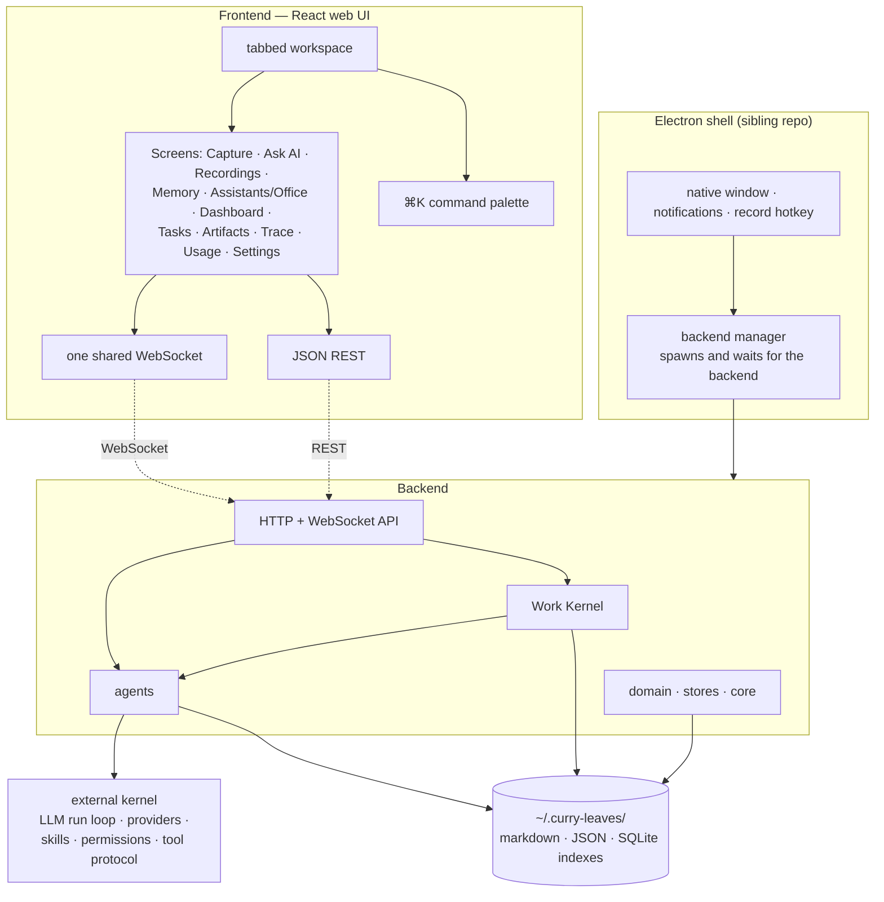
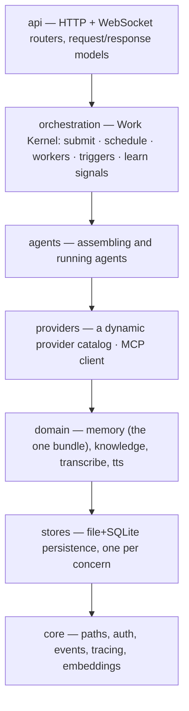
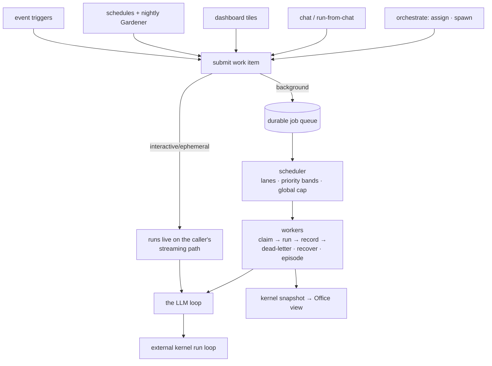
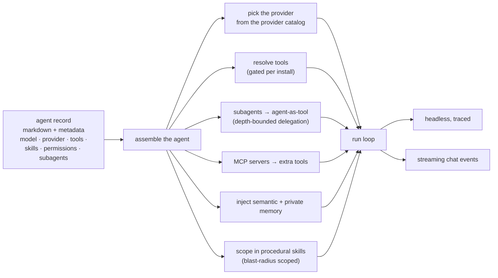
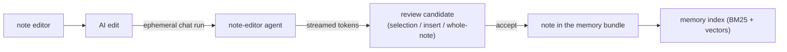
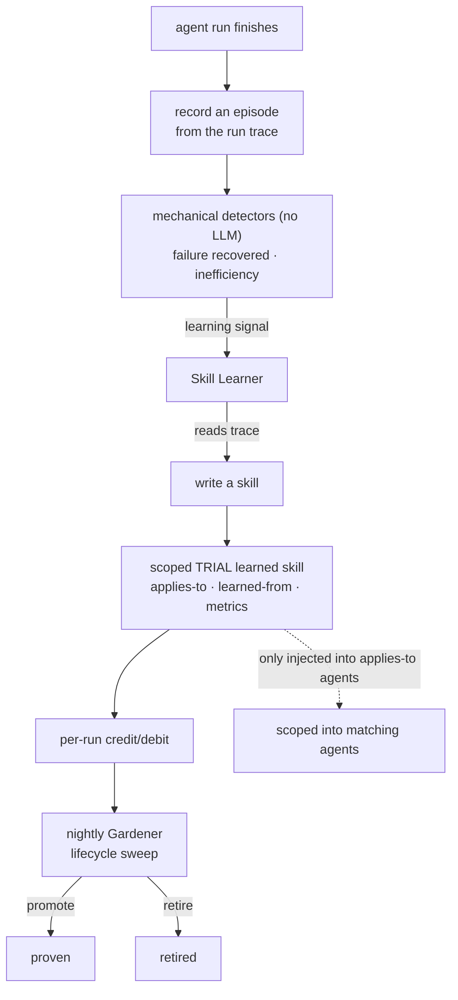
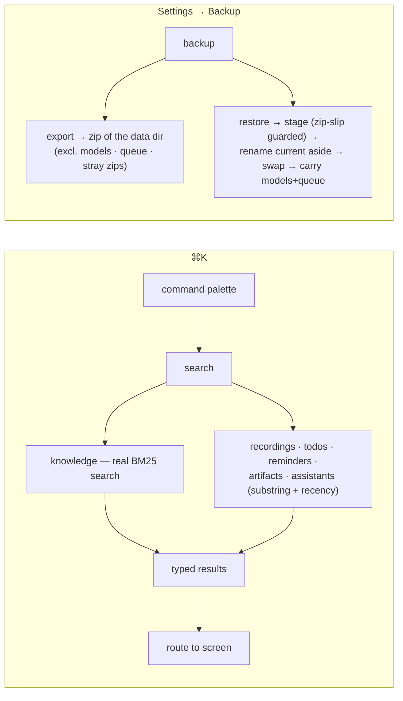
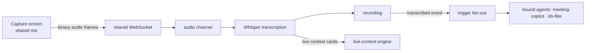
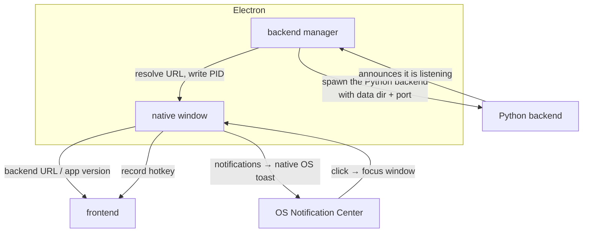

# Curry Leaves — End-to-End Architecture

How the whole app is put together, and how the pieces work as one system across the
main use cases. This is the "big picture" companion to the focused design docs
([work-kernel](design/work-kernel.md), [knowledge-base-design](design/knowledge-base-design.md),
[artifact-store-design](design/artifact-store-design.md),
[dashboard-structured-tiles-design](design/dashboard-structured-tiles-design.md),
[tracing](design/tracing.md)).

To go screen-by-screen instead — what each page does, from a user's point of view — see the
**[user guide](https://ilayanambi.com/curryleaves)** (getting started, every screen, FAQ; source at
[`guide/site/index.html`](guide/site/index.html)). It's the single end-user manual; these
architecture and design docs are the code-facing companion to it.

---

## 1. What it is, in one picture

Curry Leaves is a **voice / meeting assistant with an event-driven pool of AI agents**.
The backend + web UI in this repo ship two ways, and a thin desktop shell wraps the same UI:

- **Pip-installable server** that serves the built UI itself.
- **Docker / web mode** — same server, browser front-end.
- **Electron desktop app** — a thin native shell that builds this repo's frontend and spawns
  this backend; it lives in the sibling [`curry-leaves-assistant-desktop`](../curry-leaves-assistant-desktop) repo.

Everything a user owns lives as **plain files under `~/.curry-leaves/`**. There is no
database server; SQLite is used only as a *search/memory index* beside those files — BM25
keyword search plus, once the local embedding model is on disk, a vector tier in the same
database (see §4, "Search: keyword → hybrid").

**Transport rule of thumb:** state you *read* comes over REST; anything
*live* — the app event feed, chat token streams, the Work Kernel snapshot, and raw audio —
rides the single shared WebSocket.

---

## 2. Layers & where code lives

The backend is strictly layered, enforced at CI. Imports only ever point *downward*:

| Layer | Responsibility |
|---|---|
| **api** | HTTP + WebSocket API per domain; PIN→bearer auth; the one WebSocket endpoint. Boots the runtime. |
| **orchestration** | The **Work Kernel** — one front door for every agent run. |
| **agents** | Wraps the external kernel: turns an agent record into a live run, attaches tools/subagents/MCP/memory, runs headless or streaming. |
| **providers** | Extra LLM providers + MCP on top of the kernel's built-ins. Adding a mainstream provider is a one-line addition; users can add arbitrary OpenAI-compatible endpoints. |
| **domain** | The one memory bundle (KB + every memory kind), Whisper transcription, Kokoro speech synthesis. |
| **stores** | Durable state: agents, recordings, profile, agent memory, episodes, skills, templates, artifacts, dashboard, pool, inputs, chat sessions, usage, traces, tools, mcp. |
| **core** | `~/.curry-leaves` paths, auth, the event bus, trace context, the one embedder gate, the WebSocket hub. |

The **kernel is a separate package** (`curry-leaves-py`, a dependency of this repo). It provides the
LLM run loop, provider adapters, the skill registry, the permission engine, and the tool protocol.
This repo is the *product*; the kernel is the *engine*.

---

## 3. The Work Kernel — one substrate for every run

Every agent run — whether from chat, a trigger, a schedule, a dashboard tile, or one agent
delegating to another — becomes a single **work item** submitted through one front door. What
differs is *data on the item* (mode, lane, priority band, autonomy), not separate code paths.
(Full detail in [work-kernel.md](design/work-kernel.md).)

- **Interactive/ephemeral** (chat, AI note-edit) run on the caller's live WebSocket path —
  no durability, streamed token-by-token.
- **Background** items are written to a durable job file, scheduled by lane + priority band
  (interactive before event before background), claimed atomically by a worker, and
  **dead-lettered** after max attempts. Crash residue is recovered on boot.
- Completion futures are the join primitive that `orchestrate`'s await action and workflows
  build on.

---

## 4. An agent, assembled

Assembling an agent is where a stored agent record becomes a live, tool-wielding LLM loop. An
agent is just a markdown file with frontmatter plus a small metadata sidecar.

**Tool catalog** (each toggleable per install). Most are **action-dispatched** — one tool name
with an action argument — so the list is shorter than the capability count suggests: todos,
reminders, recordings, web fetch/search/browser, `ask` (human-in-the-loop), plus grouped sets:

| Group | Tools |
|---|---|
| knowledge | knowledge read (search·read·list·links·health), knowledge write (write·edit·delete), inputs (outline·read) |
| profile | profile read, profile update |
| private memory | remember (set·list·recall·forget) |
| episodic | remember event, recall events |
| skills | list skills, read skill, history |
| learning | learn skill, learn from chats |
| orchestration | orchestrate (assign·spawn·status·await → Work Kernel), assign (pool routing, the Lead) |
| output | artifacts, dashboard tiles |

**The memories — one bundle, partitioned by `type:`.** `~/.curry-leaves/memory/` is a single
bundle holding the knowledge base *and* every kind of memory. There is deliberately no separate
`profile/`, `episodes/`, or per-agent memory directory — the paths below are *bundle-relative*,
and the partition key is the note's `type:` field:

| Memory | `type:` | Where in the bundle | Written by | Read by |
|---|---|---|---|---|
| **Knowledge hub** | `topic`/`person`/`meeting`/… | `apps/ topics/ people/ meetings/ notes/` | knowledge writes, the filer | the Memory screen, knowledge reads |
| **Semantic** | `semantic` | `memory/profile/` | profile updates | injected into **every** agent's prompt; profile recall |
| **Private** | `private` (+ `agent:`) | `memory/agents/<id>/` | the remember tool | that agent only |
| **Episodic** | `episodic` (+ `occurred`) | `memory/episodes/<agentId>/` | the nightly Memory Keeper | recall events, the timeline |
| **Consolidated** | `consolidated` | `memory/consolidated/` | the consolidation pass | recall, like any note |
| **Procedural** | — | `skills/` bundle (**separate**) | seeds + skill learning | matching agents |

Why one bundle: consolidation clusters episodes by *a shared tag **and** a shared link*, and
tracing walks links to connect a fact back to the meeting that produced it. Across separate
bundles those edges can't exist, so both features would be structurally dead. One bundle also
means one index and one embedder handle, and recall that spans facts, runs and content in a
single query.

**Episodic is two separated things.** A finished run writes only a **stats row** (steps, outcome,
shape): pure telemetry for the learning loop, no memory note, because "ran task, 1 step, done"
per run just buries memory in noise. What becomes a `type: episodic` *note* is a **curated event**
worth referring back to, written by the nightly Memory Keeper.

**Search: keyword → hybrid.** The bundle is tier 1 (SQLite BM25) and self-upgrades to
tier 2 (**+ vectors in the same index, fused by reciprocal rank**) once the local embedding
model is on disk. One gate governs every vector search in the app: a small embedding model runs
in-process — no API key, nothing leaves the machine. Weights land on disk via a detached boot
warm, so **the tier comes up on the next start** and a cold first run stays on keyword rather
than putting a download in front of a user's query. A flag can force keyword-only.

**Seeded agents** (installed on boot). All are marked internal for UI grouping, which is *not* the
same as "not routable" — the Lead's exclusion list is separate:

| Agent | Role |
|---|---|
| `assistant` | the general chat assistant; can orchestrate |
| `lead` | routes user-posted pool items to one best-fit agent |
| `meeting-live` | in-meeting context cards |
| `meeting-copilot` | post-meeting outputs per template |
| `kb-filer` | files transcripts/documents into the bundle |
| `kb-maintainer` | applies the Gardener's repair worklist |
| `memory-keeper` | nightly: distils chats → facts + events |
| `skill-learner` | reflects on learning signals + nightly: writes trial skills |
| `dashboard-watcher` | read-only generalist so Add Tile works without authoring an agent |
| `note-editor` · `text-editor` · `title-generator` | ephemeral editing/utility runs |

---

## 5. Use case walk-throughs

### 5.1 Chatting with an assistant

A chat message opens a streaming run on the shared WebSocket: tokens, tool calls, and thinking
stream back frame by frame as the LLM loop runs, and an approval or `ask` prompt pauses the run
until the user answers. The transcript persists per session. Steer, stop, and follow-up are
supported mid-run.

### 5.2 Hiring an assistant + office walk-in

Hiring describes a role, the assistant drafts a few candidates that emphasise it differently, and
picking one saves a new agent record — which fires a hire event that the Office animates as a new
hire walking in from the front desk.

The **Office** is a CSS-3D isometric floor plan driven *entirely by existing feeds* — the kernel
snapshot (queued papers in the front-desk tray, dead drawer, wallboard counts), agent run events,
and per-run chat frames (an agent walks to the room matching the tool it's calling and "thinks out
loud").

### 5.3 Memory screen — note editing with AI

The sidebar's **Memory** screen has five tabs: **Memory** (the browsable knowledge-notes + skills
rail), **Facts** (the memory taxonomy), **Graph**, **Health**, and **Ingest**.

The Facts pane is a rail + detail pane filtered by four pills, each a `type:` in the bundle, and
each labelled in plain language rather than by its type name: `semantic` → **Facts** ("what every
assistant knows about you"), `private` → **Assistant notes**, `episodic` → **Events**,
`consolidated` → **Lessons**. One search box spans all of memory, and shows a *keyword only*
badge while the embedder isn't ready.

Consolidation (timeline, consolidation status, and running a pass) is implemented on the backend
but **no UI calls it yet** — it is currently reachable over HTTP only.

Notes are markdown-with-frontmatter in the one memory bundle, indexed for keyword search plus
vectors once the embedder is warm — the knowledge base is a thin KB-shaped view over the same
bundle. The AI edit runs as an **ephemeral** chat run (no durable job).

### 5.4 Self-improving skills loop

A closed loop: a run produces an **episode**, mechanical detectors emit a **learning signal**,
the **Skill Learner** reflects and writes a **scoped, trial** skill, runs credit/debit it, and the nightly
**Gardener** promotes proven skills / retires unhelpful ones. See the
[memory & learning section of the user guide](https://ilayanambi.com/curryleaves#learning).

### 5.5 Global search (⌘K) & backup

---

## 6. Live meeting path (capture → transcribe → agents)

Audio streams over the same shared WebSocket as everything else. On transcription, a
"transcribed" event fans out through triggers to any agent whose triggers match — the same event
mechanism that drives every other background run.

**Two meeting agents, at two different times** — the names are close enough to be worth
separating explicitly:

- **`meeting-live`** runs **during** the meeting. It watches the transcript as it streams and
  emits a small number of context cards per pass (`open-loop`, `answer`, `ask-this`,
  `decided-before`, `close-proposal`, …), arriving as live-context frames on the same socket.
  It is **doubly opt-in**, and both gates must pass: the app-level `settings.live.enabled`
  (**off by default**, since every pass is a real agent run against the user's provider — the
  Capture screen can override it for a single recording via an `enabled` field on `live.attach`),
  **and** the recording's template opting into live watching. Passes are gated by a cooldown and
  a minimum transcript growth, both read from `settings.live` on every pass so a settings change
  reaches a recording already in progress; all passes share one session so it never repeats
  itself, and failures are swallowed — it must never disturb transcription.
- **`meeting-copilot`** runs **after**, once the recording is transcribed. It produces the
  outputs the recording's template defines, in order, and turns genuinely-agreed action items
  into todos or reminders.

**Meeting templates** (Settings → Meeting templates) are what define those outputs. A template
holds an ordered list of sections and the live-watch config above; bodies can be LLM-authored and
revised in place. They **supersede recording profiles**, which are deprecated and kept only for
backward-compatible migration of the old file.

### Voice — audio out

Speech synthesis is **Kokoro-82M**, 24 kHz mono, with weights on disk, warmed in a detached boot
task because a cold first synthesis costs several seconds. It needs the system **`espeak-ng`**
binary. The backend reports whether TTS is available and the frontend hides the Voice button
entirely when it is false — so voice is doubly opt-in.

There is no HTTP route: TTS rides the shared socket as its own start → audio frames → end sequence,
cancellable mid-stream. Long replies are sentence-split and synthesized one sentence at a time, so
the first words play before the whole reply exists; markdown is stripped first so espeak doesn't
read "asterisk asterisk".

**Voice chat** closes the loop: a voice-activity detector spots end-of-utterance after a short
silence, finalization *awaits the end-of-stream flush* (a normal utterance is too short to trigger
incremental transcription, so the flush is the only text there will be), the turn is sent, and
reply tokens are sentence-split into the player. The mic is deliberately closed while speaking so
the app never transcribes its own output — which also means **barge-in is not implemented**: the
only interruption is toggling voice off.

The TTS **voice** is user-selectable — but note *where* it lives: it is owned by the wake-word
settings block rather than the recording settings, and takes precedence over the TTS voice/lang
environment overrides.

### Wake word — an app-wide voice assistant

A second, deliberately **separate** voice path from voice chat. The reason is lifecycle: screens
are tab-scoped keep-alive tabs, so a listener living inside one screen is deaf until that tab has
been opened. The wake-word assistant is mounted at the app root instead and owns its whole loop:
`off → armed → listening → thinking → speaking → answered → armed`.

**Detection runs in the browser, not the backend.** A Web Worker runs a single **fused**
openWakeWord ONNX graph on WebAssembly over a rolling ~2 s audio window, re-run several times a
second. The melspectrogram, the embedding, and the classifier are fused into one graph, and
standardization is folded in. The backend only downloads and *serves* the weights; it never runs
inference, so detection audio never leaves the device — not even to the local backend. The worker
uses the WebAssembly build (not the heavier WebGPU one) and runs single-threaded because the app
sets no cross-origin isolation headers. The frontend fetches the model bytes itself with an auth
header and hands them to the worker, so no token lands in a query string.

The wake-word endpoints serve config, accept settings patches, trigger a download, and serve the
model bytes — the last deliberately **authenticated** with a one-year immutable cache.

**Models are a directory scan, not a registry.** One builtin ships — `curry_leaves`, a fused
6-phrase model from our own [Hugging Face repo](https://huggingface.co/ilayanambi/curry-leaves-open-wake-word-model),
**Apache-2.0** (usable commercially, no swap needed). Dropping any fused model into the wake-word
models directory makes it selectable with no code change. The model emits raw **logits**
(unbounded) and is **multi-class** — the worker reads per-class phrase names and thresholds from a
sidecar file, falling back to a single cutoff only for a bare model with no sidecar.

Coordination with the shared mic: a `suppressed` flag is posted *into* the worker rather than
tearing down — a teardown would thrash the ref-counted mic. The app suppresses for the **entire
exchange**, because echo cancellation is off and the assistant's own spoken reply would otherwise
re-trigger the wake word.

Two constraints worth knowing before extending this: voice runs are **ephemeral and un-gated** (no
interactive approval host), so any tool needing approval can never resolve — a watchdog speaks
whatever partial text arrived. And answers never persist to chat history.

> **Known gaps.** The silence-duration setting is stored, sent and read into prefs but never
> consumed — the pause is always the built-in default. Worker errors are surfaced internally but
> dropped at the app root, so a detection failure is silent in the UI.

---

## 7. Desktop shell seams

The Electron layer is deliberately thin — it owns exactly what the browser can't. It lives in the
sibling [`curry-leaves-assistant-desktop`](../curry-leaves-assistant-desktop) repo (it builds this
repo's frontend and spawns this backend — nothing is duplicated):

The shell owns exactly the native seams: spawning and supervising the backend, handing the
frontend the backend URL and app version, OS notifications, and a global record hotkey. In web/pip
mode there is no Electron at all — the built UI is bundled into the Python package and the backend
serves it as a single-page-app fallback.

---

## 8. Cross-cutting

- **Tracing** — every run is captured as spans, surfaced in the Trace screen.
  See [tracing.md](design/tracing.md).
- **Usage / cost** — a token ledger (per agent + cost) feeds the Usage screen and per-assistant
  spend chips.
- **Auth & first run** — a PIN is exchanged for a bearer token. Boot is a four-stage gate:
  `connecting` (a health probe which, after a few seconds, offers an editable **Backend URL** —
  also how a browser tab targets a remote backend) → `setup` → `login` → `app`. The **setup
  wizard** shows only while the install reports itself unconfigured; there is deliberately no
  separate "onboarding done" flag, because creating the PIN *is* the last step and configuring it
  is what ends the wizard. While no PIN exists the API runs in **setup mode** — open, on the
  reasoning that anyone who can reach the port could claim the install by setting a PIN anyway.
  This is what lets the un-authenticated wizard steps write real state. An environment variable can
  seed the PIN at boot and skip the wizard entirely (headless/Docker). The wizard's *How you'll use
  it* step records how the user intends to use the app, which is injected into every agent's prompt
  as a "## Who you're helping" block.
- **Events** — an append-only event bus with gap-free replay — the backbone for triggers, the
  Office, and the live feed.
- **Providers & MCP** — the provider catalog is **dynamic**, not a hardcoded list: 13 built-ins
  (Anthropic, OpenAI, Google, Groq, Together, OpenRouter, DeepSeek, Mistral, xAI, Perplexity + the
  three special cases below) where any OpenAI-compatible service is a one-line addition, **plus
  user-added custom endpoints** (Settings → AI providers → *Add custom provider*). The UI builds
  itself entirely from the catalog. Copilot and Codex use non-blocking **device-code** flows driven
  by the UI; Ollama is probed locally. A candidate key is validated before saving, so a dead key is
  refused rather than stored. Per provider, four optional **effort tiers** (less/medium/heavy/smart)
  pick a model each. Plus an MCP client on top of the kernel's adapters. See
  [oauth-provider-registration.md](design/oauth-provider-registration.md) for bringing your own OAuth
  client ids.
- **Backup & export** — per-category sizes, an export that streams a zip of the data directory, and
  a staged restore validated against marker paths so an arbitrary zip is rejected. Models and the
  live queue are excluded and preserved across a restore — weights are re-downloadable and the live
  queue isn't state worth moving between machines.
- **Global search (⌘K)** — one query fans across six silos (knowledge, recordings, todos,
  reminders, artifacts, agents) with per-type caps. Knowledge rides the real BM25 index; the rest
  use position-and-recency-scored substring matching. Typing `>` switches the palette to command
  mode and skips the network call entirely.

---

## 9. Data on disk (`~/.curry-leaves/`)

| Path | Contents |
|---|---|
| `settings.json` · `todos.json` · `reminders.json` | app config + simple lists |
| `agents/<id>.md` + `<id>.meta.json` | agent definitions (portable markdown + triggers/schedule/history sidecar) |
| `recordings/<id>/` | audio + transcripts |
| **`memory/`** | **the one `cl_memory` bundle** — knowledge notes (`apps/ topics/ people/ meetings/ notes/`) *and* every memory kind (`memory/profile/`, `memory/agents/<id>/`, `memory/episodes/<agentId>/`, `memory/consolidated/`), partitioned by each note's `type:` |
| `memory/assets/` | image attachments for notes, referenced as bundle-relative markdown (``) so the vault stays portable; written and served by `domain/knowledge_assets.py` + `GET|POST /knowledge/asset` |
| `memory/.index/` | derived + disposable: `index.db` (FTS5/BM25 + vectors) and `stats.db` (the per-run episodic stats mirror) |
| `skills/` | procedural memory (skills, incl. learned) — a **separate** bundle |
| `templates/` | meeting templates (superseded recording profiles) |
| `models/` | local model weights: Whisper, MiniLM embeddings, Kokoro TTS, and `wakeword/` (fused openWakeWord ONNX — user-supplied models land here too) |
| `pool/` | the common task pool |
| `queue/<jobId>.json` + `queue/dead/` | durable job queue + dead-letters |
| `runs/<agentId>/<jobId>.json` | run records |
| `traces/<traceId>.jsonl` | spans |
| `usage/` | token/cost ledger |
| `dashboard/` · `artifacts/<id>/` | structured tiles + artifacts |
| `events/log.ndjson` | the event bus |
